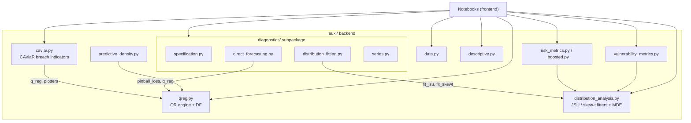

# Architecture — Oil-at-Risk TFM

> Context file for Claude. Read at the start of each session. Last verified against the code on 2026-06-28.
> Keep this file in sync whenever modules move, are added, or change responsibility.

## What this project is

A master's thesis (TFM) that adapts the **Growth-at-Risk / Vulnerable Growth** framework
(Adrian, Boyarchenko & Giannone, 2019) to the **crude oil** market — "Oil-at-Risk". The
empirical pipeline is: quantile regression of Brent returns on risk factors (geopolitical
risk, uncertainty, volatility, fundamentals) → fit a smooth conditional density (Johnson SU
or Azzalini skew-t) at each date → derive risk and vulnerability metrics (VaR, CVaR, tail
entropy, skewness) → evaluate forecasts out-of-sample.

The repository splits cleanly into a **Python backend** (`auxi/`, reusable and tested) and a
**Jupyter notebook frontend** (the analysis surface, one notebook per research question).

## Two-layer shape

```
main_code/
├── auxi/                  ← BACKEND: importable Python package of estimators, metrics, diagnostics
│   ├── qreg.py            ← quantile-regression engine + direct-forecasting (DF) estimators/plotters
│   ├── caviar.py          ← CAViaR with breach indicators (h-aware, no lookahead)
│   ├── distribution_analysis.py  ← JSU & skew-t fitters, MDE, PDFs, OOS parameter generators
│   ├── predictive_density.py     ← in-sample predictive density surface (Adrian Fig. 1)
│   ├── risk_metrics.py / risk_metrics_boosted.py  ← VaR & CVaR (readable vs. vectorized)
│   ├── vulnerability_metrics.py  ← tail KL-divergence (relative entropy) & time-varying skewness
│   ├── data.py            ← FRED download, panel generation, import_data
│   ├── descriptive.py     ← descriptive stats + rolling-window selection
│   ├── diagnostics/       ← SUBPACKAGE: evaluation diagnostics organized by type
│   │   ├── __init__.py            ← flat re-exports (import auxi.diagnostics as diags)
│   │   ├── specification.py       ← QR model tests: DQ, Wald, Q-ARCH, QAR stability
│   │   ├── direct_forecasting.py  ← forecast evaluation: rolling-window pinball, Kupiec, Christoffersen, fallout, residual ACF
│   │   ├── distribution_fitting.py← goodness-of-fit: KS, PIT calibration, fit-and-diagnose bundles
│   │   ├── ews.py                 ← early warning system: CCF, Granger causality, anticipation tests
│   │   └── series.py              ← stationarity (ADF), Hamilton trend filter
│   └── README.md          ← one-line module map (the quick index)
├── *.ipynb                ← FRONTEND: notebooks (descriptive, specification, forecasting, distributions, risk, factors)
├── tests/                 ← pytest suite (conftest fixture + module tests)
├── docs/superpowers/      ← design specs + implementation plans (the "why" of past work)
└── context/               ← THIS folder: persistent context for Claude
```

The wider repo (one level up, `…/MQuEA/TFM/`) also holds `data/` (raw `xlsx` + generated
panels), `references/` (the papers the methodology rests on), `deliverable/` (drafts of the
written thesis), and `results/` (saved figures and OOS output).

## Backend: module responsibilities

The backend is a flat collection of single-purpose modules imported from the project root as
`from auxi.qreg import …` (note: `auxi/` itself has **no** top-level `__init__.py`; only the
`diagnostics/` subpackage is a real package). Each module owns exactly one concern.

**Estimation engines.** `qreg.py` is the core: `q_reg` builds a `statsmodels`
`smf.quantreg` formula and fits one tau; `multiple_q_regs` loops over a quantile grid and
returns a tidy `master_df` (one row per regressor × tau). It also hosts the **direct
forecasting** estimators (`direct_forecasting`, `insample_direct_forecasting`,
`get_oos_predictions`) because direct forecasting *is* quantile regression on an h-shifted
target. `caviar.py` is the CAViaR layer (Engle & Manganelli, 2004): it computes binary
breach indicators (`_i` variant) and severity-based breach distances (`_s` variant) and adds
them as regressors. Its key public entry points are `compute_breach_indicators` (binary,
h-aware) and `compute_breach_severity_indicators` (severity, h-aware), which fit the quantile
bounds on the training slice only, predict over the panel, lag by `h`, and compare — **h-aware
and lookahead-free**.

**Distributions.** `distribution_analysis.py` fits the two candidate return densities —
Johnson SU and Azzalini & Capitanio skew-t — by both MLE and **Minimum Distance Estimation
(MDE)** against forecasted quantiles, plus PDFs/CDFs/samplers and OOS parameter generators.
`predictive_density.py` stacks in-sample conditional densities over time into the 3-D
waterfall surface that replicates Adrian et al. (2019), Figure 1.

**Metrics.** `risk_metrics.py` computes VaR and CVaR for both tails (left = Oil-at-Risk
downside, right = Growth-at-Risk upside), in conditional (JSU) and unconditional (historical
simulation) flavours. `risk_metrics_boosted.py` is a drop-in vectorized replacement with the
*same public API and same numbers* (matches to ~1e-11) but a fast OOS path.
`vulnerability_metrics.py` computes tail KL-divergence (relative entropy vs. a Normal
baseline, decomposed Full / Left / Right) and time-varying skewness, with both expanding- and
rolling-window OOS backtests.

**Data + descriptives.** `data.py` downloads from FRED, builds the daily/monthly panels, and
exposes `import_data`. `descriptive.py` holds descriptive statistics and window-selection
helpers (e.g. `optimize_gprd_window`).

**Diagnostics subpackage.** `diagnostics/` is the one place where heterogeneity justified a
real package (its contents are diverse by accident of history, not by design). Four thematic
submodules, with `__init__.py` re-exporting every public name so `diags.dq_test(...)`,
`diags.evaluate_direct_forecasting(...)`, and `diags.jsu_ks_test(...)` all resolve flatly.

The forecast-evaluation layer (`diagnostics/direct_forecasting.py`) is **rolling-window first**:
`compute_rolling_pinball` slides a fixed-width (1000-obs) training window across the test set,
refitting at every forecast origin and averaging the h-step pinball loss per `(horizon, tau)` —
it evaluates a *list* of quantiles at once, and `plot_rolling_pinball` overlays them on one
chart. `get_oos_predictions_rolling` is the rolling analogue used to feed the Kupiec /
Christoffersen coverage tests. The old single-split evaluator survives as
`evaluate_direct_forecasting_single` (with `evaluate_direct_forecasting` kept as a backward-compat
alias). See `decisions.md` and `known_errors.md` for why the single split was replaced.

The **Diebold-Mariano test** layer (`tick_loss_series`, `diebold_mariano_test`,
`compute_dm_comparison`) compares models pairwise using the asymmetric tick loss.
`compute_dm_comparison` takes a dict of pre-computed forecast series, aligns them on
a common index, produces an error-metrics table (RMSE, MAPE, tick loss) and a pairwise
DM table (alpha, t-stat, p-value with significance stars). The DM statistic uses a
rectangular-kernel HAC variance with bandwidth h-1 (Diebold & Mariano, 1995).

The **EWS layer** (`diagnostics/ews.py`) tests whether indicator series (tail entropy)
anticipate a target (Brent returns) via cross-correlation functions, Granger causality
with AIC/BIC lag selection, and combined anticipation tests. `compute_ews_battery` runs
the full test across multiple indicators; `compute_coherence_test` checks pairwise
coherence among indicators. Adapted from Bujosa, García-Ferrer & de Juan (2013).

## Frontend: the notebooks

Each notebook is a stage of the empirical analysis and imports the backend rather than
defining estimators inline:

- `descriptive_analysis.ipynb`, `oil_descriptive.ipynb`, `gpr_descriptive.ipynb` — data exploration.
- `specification.ipynb` — quantile-regression specification + model diagnostics.
- `direct_forecasting.ipynb` — out-of-sample forecasting (`import auxi.qreg as fc`, `import auxi.diagnostics as diags`).
- `distribution_analysis.ipynb` — JSU / skew-t fitting + PIT calibration.
- `risk_metrics.ipynb` — VaR / CVaR / vulnerability metrics.
- `common_factors.ipynb` — common-factor / quantile-factor work.

Notebooks are the **consumers**; they are also the integration test surface (a "smoke test" is
*Restart Kernel → Run All*). Logic that is reused across notebooks belongs in `auxi/`, never
copied between notebooks.

## Dependency graph (import-time)



Read the arrows as "imports from". The two load-bearing hubs are `qreg.py` (everything
quantile flows through it) and `distribution_analysis.py` (everything density flows through
it). `caviar.py` and `diagnostics/` are deliberately thin consumers of `qreg.py` to avoid
duplicating the regression machinery.

## Data flow, end to end

1. `data.py` pulls Brent / VOIL / VIX from FRED and merges control series (GPR, EPU, REIA,
   inflation, US oil production/stocks, BADI) from `data/raw/*.xlsx` into a daily and a
   monthly **panel** (`data/daily_panel.csv`, `data/monthly_panel.csv`).
2. A notebook loads a panel via `import_data` and selects a specification (`vars_x`, `vars_y`,
   controls, quantile grid, horizon `h`).
3. `qreg` / `caviar` estimate conditional quantiles (contemporaneous for specification work,
   h-shifted for forecasting).
4. `distribution_analysis` fits a smooth density to the estimated quantiles per date (MDE).
5. `risk_metrics` / `vulnerability_metrics` / `predictive_density` turn the fitted densities
   into VaR, CVaR, tail entropy, skewness, and the density surface.
6. `diagnostics/*` validate every stage (model specification, forecast coverage, distribution
   calibration, stationarity).
7. Figures and OOS tables land in `results/`.

## Where to look for the "why"

`docs/superpowers/specs/` holds the approved design documents and
`docs/superpowers/plans/` the task-by-task implementation plans. These explain *intent*. Be
aware they are point-in-time records: some (notably the 2026-06-26 reorg spec's lookahead
discussion) were **superseded** by later code — see `decisions.md` and `known_errors.md`. The
code is the ground truth; the specs are the rationale.
