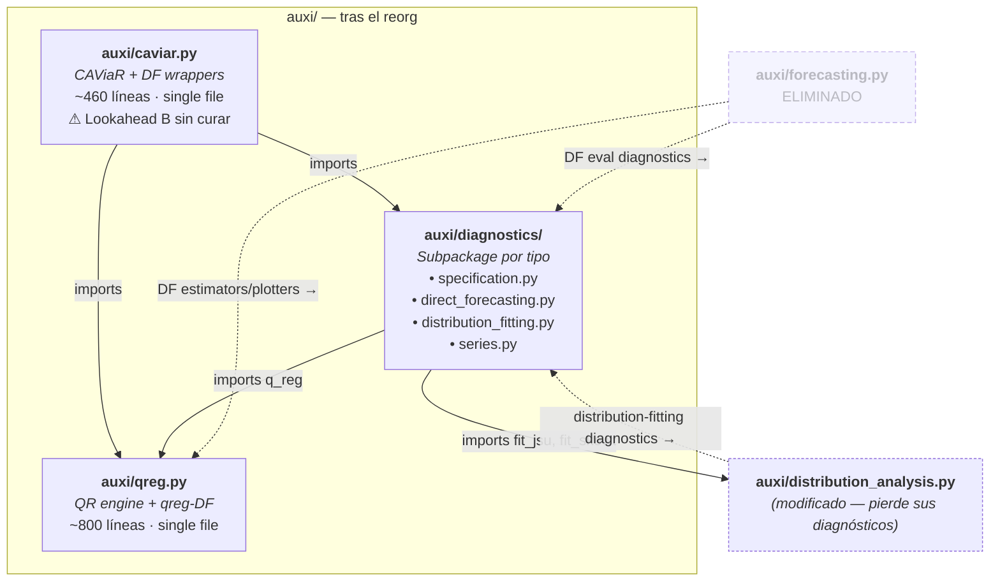

# Backend Reorganization — `auxi/` modules consolidation

**Fecha:** 2026-06-26
**Estado:** Diseño aprobado, pendiente de implementación
**Relacionado con:** [`2026-06-25-caviar-indicator-design.md`](2026-06-25-caviar-indicator-design.md)

## Contexto y motivación

El folder `auxi/` ha crecido orgánicamente. `forecasting.py` mezcla tres cosas distintas: (a) estimadores de *direct forecasting* que **son** regresiones cuantílicas; (b) diagnósticos de evaluación de pronóstico que son **agnósticos al modelo** dado `(realized, forecasted)`; (c) helpers internos. Con la incorporación de `caviar_i` como segundo modelo capaz de hacer *direct forecasting*, las fronteras se vuelven aún más difusas.

Este reorg consolida por **propósito**, no por categoría histórica:

- Los estimadores de DF viven con el modelo que ajustan.
- Los diagnósticos de evaluación de DF son compartidos.
- Caviar reutiliza el esqueleto de qreg vía wrappers finos (Approach C), evitando duplicación.

## Decisiones de diseño acordadas

1. **Single-file para qreg y caviar; subpackage para diagnostics.** `qreg.py` y `caviar.py` siguen como archivos únicos — cada uno cubre **un solo concern** (un motor de modelo + su DF). Crecerán pero se mantienen navegables con marcadores de sección. **`diagnostics`** sí se convierte en subpackage `auxi/diagnostics/` con submódulos por tipo de diagnóstico, porque su contenido es heterogéneo por accidente histórico (model tests, forecast evals, series utilities), no por diseño.

2. **Estimadores DF viven con su modelo.** Los DF qreg-flavored se mueven de `forecasting.py` a `qreg.py`. Los DF de caviar viven en `caviar.py` como wrappers finos.

3. **Diagnósticos de evaluación DF son compartidos.** Viven en `diagnostics.py`, Sección B. Toman `(realized, forecasted, tau)` (model-agnostic) o reajustan un modelo cuantílico internamente (qreg-flavored). Las versiones caviar son wrappers en `caviar.py`.

4. **Approach C — caviar wrappers aumentan el panel.** Cada wrapper:
   - Computa bounds desde el panel completo.
   - Computa indicadores de breach (`upside_breach`, `downside_breach`).
   - Aumenta una copia del panel con dos columnas binarias.
   - Delega a la función `qreg.*` o `diagnostics.*` correspondiente, con `controls = controls_originales + ["upside_breach", "downside_breach"]`.

   Cada wrapper son ~10 líneas. **El panel del usuario nunca se muta.**

5. **Lookahead (B) deferred.** Los bounds se ajustan sobre el panel completo; los datos posteriores a la fila `t` se filtran al `breach_t`. El shift del direct forecasting cura sólo el lookahead trivial (A — predecir el presente desde el presente). El leak del ajuste in-sample sobrevive. El refactor honesto (slice-aware bounds) está fuera de alcance.

6. **`select_horizon_rolling_origin` eliminada.** Fuera de alcance.

7. **`forecasting.py` eliminada.** Dos notebooks actualizan sus imports.

8. **Sin normalización de signaturas de diagnósticos.** `compute_fallout_errors` y `diagnose_residual_acf` reajustan qreg internamente — inconsistente con Kupiec/Christoffersen que toman `(realized, forecasted)`. Funciona, no se rompe nada, no se refactoriza aquí. Anotado como tidying futuro.

9. **Diagnósticos de distribution-fitting se centralizan.** `jsu_ks_test`, `evaluate_oos_pit`, `oos_pit_calibration`, `plot_oos_pit_calibration`, `evaluate_oos_pit_skewt`, y los bundles `fit_and_diagnose_jsu`/`fit_and_diagnose_skewt` salen de `distribution_analysis.py` y entran en `auxi/diagnostics/distribution_fitting.py`. Los **fitters** (`fit_jsu`, `fit_skewt`, etc.) se quedan en `distribution_analysis.py`. Los bundles importan los fitters desde allí.

10. **`auxi/diagnostics/__init__.py` reexporta los nombres públicos** de cada submódulo. `import auxi.diagnostics as diags` y `diags.<funcname>` siguen funcionando para todo lo que ya era público — esto preserva la compatibilidad de notebooks para los nombres que existían antes.

## Arquitectura final

### `auxi/qreg.py` — Quantile Regression engine + qreg-flavored DF

| Sección | Funciones | Status |
|---|---|---|
| 1. Engine | `q_reg`, `multiple_q_regs` | existing |
| 2. Engine plotters | `plot_quantile_coefs`, `plot_pseudo_r2`, `plot_residuals`, `plot_quantile_results` | existing |
| 3. DF helpers | `pinball_loss` | moved from `forecasting.py` |
| 4. DF estimators | `direct_forecasting`, `insample_direct_forecasting`, `get_oos_predictions` | moved from `forecasting.py` |
| 5. DF plotters | `plot_forecasted_scatters`, `plot_contemporaneous_vs_predictive_coefs` + helpers privados `_plot_coef_panel`, `_add_regression_lines` | moved from `forecasting.py` |

Tamaño aproximado tras el move: ~800 líneas.

### `auxi/caviar.py` — CAViaR estimators + DF wrappers (Approach C)

| Sección | Funciones | Status |
|---|---|---|
| 1. Capa 1 — helpers | `_compute_quantile_bounds`, `_compute_breaches` | existing |
| 2. Capa 2 — estimadores | `caviar_i`, `multiple_caviar_i` | existing |
| 3. Capa 3 — plotters | `plot_breach_diagnostics`, `plot_caviar_i_results` | existing |
| 4. Capa 4 — DF estimator wrappers | `caviar_direct_forecasting`, `caviar_insample_direct_forecasting`, `caviar_get_oos_predictions` | NEW |
| 5. Capa 5 — DF plotter wrappers | `caviar_plot_forecasted_scatters`, `caviar_plot_contemporaneous_vs_predictive_coefs` | NEW |
| 6. Capa 6 — DF eval wrappers | `caviar_evaluate_direct_forecasting` | NEW |

El módulo importa de `qreg.py` (existente: `q_reg`, `plot_quantile_coefs`, `plot_pseudo_r2`; nuevo: las funciones de DF) y de `diagnostics.py` (nuevo: `evaluate_direct_forecasting`).

**Docstring del módulo:** añadir nota explícita sobre el lookahead (B) sin curar, para que `?caviar.caviar_direct_forecasting` la muestre.

Tamaño aproximado tras el move: ~460 líneas.

### `auxi/diagnostics/` — Subpackage de diagnósticos

`auxi/diagnostics.py` se convierte en directorio `auxi/diagnostics/` con cuatro submódulos por tipo de diagnóstico, más un `__init__.py` que reexporta para preservar compatibilidad.

```
auxi/diagnostics/
  __init__.py             # reexports — `import auxi.diagnostics as diags` sigue funcionando
  specification.py        # QR model diagnostics
  direct_forecasting.py   # DF evaluation (compartida qreg/caviar)
  distribution_fitting.py # goodness-of-fit para JSU / Skew-t
  series.py               # series/data utilities
```

**`auxi/diagnostics/specification.py`**

| Funciones | Status |
|---|---|
| `dq_test` + `plot_advanced_dq_diagnostics`, `wald_test` + `plot_wald_diagnostics`, `q_arch_test` + `plot_q_arch_diagnostics`, `qarx_stability_test` | existing en `diagnostics.py` |

**`auxi/diagnostics/direct_forecasting.py`**

| Funciones | Status |
|---|---|
| `evaluate_direct_forecasting` | moved from `forecasting.py` |
| `compute_fallout_errors` + `plot_fallout_errors`, `evaluate_cumulative_fallout` | moved from `forecasting.py` |
| `compute_unconditional_coverage_unified` + `plot_unconditional_coverage_unified` | moved from `forecasting.py` |
| `compute_conditional_coverage` + `plot_conditional_coverage` | moved from `forecasting.py` |
| `plot_unconditional_coverage`, `diagnose_residual_acf` | moved from `forecasting.py` |

**`auxi/diagnostics/distribution_fitting.py`**

| Funciones | Status |
|---|---|
| `jsu_ks_test`, `evaluate_oos_pit`, `oos_pit_calibration`, `plot_oos_pit_calibration`, `evaluate_oos_pit_skewt` | moved from `distribution_analysis.py` |
| `fit_and_diagnose_jsu`, `fit_and_diagnose_skewt` | moved from `distribution_analysis.py` (importan `fit_jsu`/`fit_skewt` desde allí) |

**`auxi/diagnostics/series.py`**

| Funciones | Status |
|---|---|
| `adf_test_all`, `hamilton_filter` | existing en `diagnostics.py` |

**`auxi/diagnostics/__init__.py`** — reexports explícitos (no `from .X import *`), uno por submódulo. Mantiene la API plana: `diags.dq_test(...)`, `diags.evaluate_direct_forecasting(...)`, `diags.jsu_ks_test(...)`, etc.

**Tamaños aproximados:** `specification.py` ~280 líneas, `direct_forecasting.py` ~520, `distribution_fitting.py` ~400, `series.py` ~30. Cada uno por debajo del umbral de incomodidad — un archivo por tipo de diagnóstico.

### `auxi/distribution_analysis.py` — modificado (pierde sus diagnósticos)

Pierde las 7 funciones listadas arriba (`jsu_ks_test`, `evaluate_oos_pit`, `oos_pit_calibration`, `plot_oos_pit_calibration`, `evaluate_oos_pit_skewt`, `fit_and_diagnose_jsu`, `fit_and_diagnose_skewt`). Mantiene todo lo demás (fitters, PDF/CDF/sample, MDE, comparators, OOS-parameter generators).

Reducción aproximada: de ~1450 líneas a ~1050 líneas.

### `auxi/forecasting.py`

**Eliminada.** Se actualizan dos imports en notebooks (ver Plan de migración).

### Módulos no tocados

`data.py`, `descriptive.py`, `predictive_density.py`, `distribution_analysis.py`, `risk_metrics.py`, `risk_metrics_boosted.py`, `vulnerability_metrics.py`. Sus imports a `auxi.qreg` y `auxi.distribution_analysis` siguen funcionando sin cambios.

## Diagrama de la arquitectura

Vista de alto nivel de los tres módulos finales, sus dependencias por imports, y el destino del antiguo `forecasting.py`. Las tablas de la sección anterior cubren el inventario de funciones; este diagrama cubre la forma.



**Cómo leer el diagrama:**
- Flechas sólidas: imports en tiempo de ejecución del estado final. `caviar.py` consume de `qreg.py` y `diagnostics/` (es el patrón Approach C). El subpackage `diagnostics/` consume de `qreg.py` para reajustar modelos cuantílicos, y de `distribution_analysis.py` para reutilizar `fit_jsu` / `fit_skewt` en los bundles diagnósticos.
- Flechas punteadas: redistribución histórica. Documentan dónde fueron los contenidos eliminados o movidos para que futuro-tú no se quede buscando.
- La caja de `caviar.py` lleva la nota de la limitación conocida (lookahead B) en el diagrama mismo — para que `caviar.caviar_direct_forecasting?` y este diagrama coincidan.
- `distribution_analysis.py` aparece como modificado (no eliminado) — pierde sus 7 funciones diagnósticas pero conserva los fitters.

## Patrón de wrapper caviar (Approach C)

Esqueleto común a todos los wrappers de `caviar.py` Capas 4–6:

```python
def caviar_<X>(df, vars_x, vars_y, ..., breach_quantiles=None, controls=None, **kwargs):
    """Caviar DF wrapper: augment panel with breach indicators, delegate."""
    if breach_quantiles is None:
        breach_quantiles = [0.05, 0.95]
    if isinstance(vars_x, str):
        vars_x = [vars_x]

    # 1. Bounds + breaches (reuse Capa 1 helpers; full-panel fit — lookahead B)
    bounds = _compute_quantile_bounds(
        df, vars_x, vars_y, min(breach_quantiles), max(breach_quantiles)
    )
    upside, downside = _compute_breaches(df[vars_y], bounds)

    # 2. Augment a copy of the panel (df nunca se muta)
    work = df.copy()
    work["upside_breach"] = upside
    work["downside_breach"] = downside

    # 3. Match caviar_i's signature collapse: vars_x[0] -> x, resto -> controls
    augmented_controls = (
        list(vars_x[1:]) + (controls or []) + ["upside_breach", "downside_breach"]
    )
    return <delegate>(work, x=vars_x[0], y=vars_y, ...,
                      controls=augmented_controls, **kwargs)
```

### Tabla de delegación

| Caviar wrapper | Delegate |
|---|---|
| `caviar_direct_forecasting` | `qreg.direct_forecasting` |
| `caviar_insample_direct_forecasting` | `qreg.insample_direct_forecasting` |
| `caviar_get_oos_predictions` | `qreg.get_oos_predictions` |
| `caviar_plot_forecasted_scatters` | `qreg.plot_forecasted_scatters` |
| `caviar_plot_contemporaneous_vs_predictive_coefs` | `qreg.plot_contemporaneous_vs_predictive_coefs` |
| `caviar_evaluate_direct_forecasting` | `diagnostics.evaluate_direct_forecasting` |

### Contrato de signaturas

- Wrappers caviar toman `vars_x` (list o str), consistente con `caviar_i`.
- Internamente colapsan `vars_x[0]` → parámetro `x` del delegate; `vars_x[1:]` → al inicio de `controls`.
- `breach_quantiles` default `[0.05, 0.95]`.
- `**kwargs` se reenvían al delegate intactos.
- Retornan exactamente lo que retorna el delegate.

## Limitaciones conocidas

### Lookahead (B) en wrappers caviar

`_compute_quantile_bounds` ajusta ambas regresiones de cola sobre el panel completo. El `Bound_High_t` evaluado en la fila `t` depende de coeficientes aprendidos con filas posteriores a `t`. El shift del direct forecasting cura sólo el leak trivial (A — predecir `y_t` desde una función de `y_t`); el leak del ajuste in-sample sobrevive.

**Dónde más muerde:**
- `caviar_get_oos_predictions` y `caviar_evaluate_direct_forecasting`: la pérdida pinball OOS se verá mejor de lo honesto porque los indicadores de breach usados en entrenamiento y predicción fueron parcialmente construidos con el slice de test.
- `caviar_direct_forecasting` y `caviar_insample_direct_forecasting`: el forecast único al final de la ventana de entrenamiento es honesto en esa fila; las filas de entrenamiento in-sample siguen viendo datos futuros.

**Cura (diferida):** dividir `_compute_quantile_bounds` en (i) fit-on-slice y (ii) predict-on-full-panel, y que cada wrapper caviar pase su slice de entrenamiento. Sesión futura.

### Inconsistencia de signaturas en diagnósticos

`compute_fallout_errors` y `diagnose_residual_acf` reajustan una `q_reg` internamente en lugar de tomar `(realized, forecasted)`. Es inconsistente con Kupiec/Christoffersen. **No se normaliza aquí** — funciona, no es load-bearing para el reorg. Anotado para tidying futuro.

## Plan de migración

### Orden de operaciones

1. **Append a `qreg.py`** — copiar de `forecasting.py`:
   - `pinball_loss` → Sección 3.
   - `direct_forecasting`, `insample_direct_forecasting`, `get_oos_predictions` → Sección 4.
   - `plot_forecasted_scatters`, `plot_contemporaneous_vs_predictive_coefs`, `_plot_coef_panel`, `_add_regression_lines` → Sección 5.
   - Test: `import auxi.qreg` no falla.

2. **Crear el subpackage `auxi/diagnostics/`** — pasos secuenciales:
   - **2a.** Crear el directorio `auxi/diagnostics/`.
   - **2b.** Crear `auxi/diagnostics/specification.py` con los QR model tests existentes de `diagnostics.py` (`dq_test` + plotter, `wald_test` + plotter, `q_arch_test` + plotter, `qarx_stability_test`). Incluir sus imports actuales.
   - **2c.** Crear `auxi/diagnostics/series.py` con `adf_test_all` y `hamilton_filter` desde el `diagnostics.py` actual.
   - **2d.** Crear `auxi/diagnostics/direct_forecasting.py` con las funciones DF-evaluation movidas desde `forecasting.py` (lista completa en la tabla de la Sección "Arquitectura final" arriba).
   - **2e.** Crear `auxi/diagnostics/distribution_fitting.py` moviendo desde `auxi/distribution_analysis.py`: `jsu_ks_test`, `evaluate_oos_pit`, `oos_pit_calibration`, `plot_oos_pit_calibration`, `evaluate_oos_pit_skewt`, `fit_and_diagnose_jsu`, `fit_and_diagnose_skewt`. Los bundles `fit_and_diagnose_*` añaden `from auxi.distribution_analysis import fit_jsu, fit_skewt` arriba.
   - **2f.** Crear `auxi/diagnostics/__init__.py` con reexports explícitos de cada submódulo (uno por función pública). Patrón:
     ```python
     from .specification import (
         dq_test, plot_advanced_dq_diagnostics,
         wald_test, plot_wald_diagnostics,
         q_arch_test, plot_q_arch_diagnostics,
         qarx_stability_test,
     )
     from .direct_forecasting import (
         evaluate_direct_forecasting,
         compute_fallout_errors, plot_fallout_errors,
         evaluate_cumulative_fallout,
         compute_unconditional_coverage_unified, plot_unconditional_coverage_unified,
         compute_conditional_coverage, plot_conditional_coverage,
         plot_unconditional_coverage,
         diagnose_residual_acf,
     )
     from .distribution_fitting import (
         jsu_ks_test,
         evaluate_oos_pit, evaluate_oos_pit_skewt,
         oos_pit_calibration, plot_oos_pit_calibration,
         fit_and_diagnose_jsu, fit_and_diagnose_skewt,
     )
     from .series import adf_test_all, hamilton_filter
     ```
   - **2g.** Borrar el archivo `auxi/diagnostics.py` (todo su contenido vive ya en el subpackage).
   - **2h.** Borrar de `auxi/distribution_analysis.py` las 7 funciones movidas a `distribution_fitting.py`.
   - **Test:** `import auxi.diagnostics as diags; diags.dq_test, diags.jsu_ks_test, diags.evaluate_direct_forecasting` resuelven sin error.

3. **Append a `caviar.py`** — añadir Capas 4–6 con los 6 wrappers según el esqueleto. Actualizar docstring del módulo con la nota de lookahead.
   - Test: `import auxi.caviar` no falla; `caviar.caviar_direct_forecasting?` muestra la nota.

4. **Actualizar imports y llamadas en notebooks.**

   Auditoría exhaustiva — sólo dos notebooks tocan `auxi.forecasting`:

   **`distribution_analysis.ipynb`** — 1 import cambiado + 1 import añadido + 5 llamadas redirigidas
   - Línea de import: `from auxi.forecasting import insample_direct_forecasting` → `from auxi.qreg import insample_direct_forecasting`.
   - Añadir: `import auxi.diagnostics as diags`.
   - Reescribir las 5 llamadas de distribution-fitting diagnostics (ya no viven en `da`):

   | Llamada actual | Ocurrencias | Acción |
   |---|---|---|
   | `da.fit_and_diagnose_jsu` | 1 | → `diags.fit_and_diagnose_jsu` |
   | `da.evaluate_oos_pit` | 1 | → `diags.evaluate_oos_pit` |
   | `da.fit_and_diagnose_skewt` | 1 | → `diags.fit_and_diagnose_skewt` |
   | `da.evaluate_oos_pit_skewt` | 2 | → `diags.evaluate_oos_pit_skewt` |

   El resto de llamadas a `da.<funcname>` (fitters, MDE, comparators, etc.) se quedan iguales — esas funciones permanecen en `distribution_analysis.py`.

   **`direct_forecasting.ipynb`** — 1 import + 12 llamadas para redirigir + 1 celda rota

   - Línea de import: `import auxi.forecasting as fc` → `import auxi.qreg as fc`.
   - Añadir nuevo import: `import auxi.diagnostics as diags`.
   - Reescribir cada llamada según esta tabla. Estrategia: buscar `fc.<nombre>` en el notebook y aplicar la acción a cada ocurrencia (la columna "ocurrencias" dice cuántas hay).

   | Llamada actual | Ocurrencias | Acción |
   |---|---|---|
   | `fc.direct_forecasting` | 1 | sin cambios (resuelve vía `auxi.qreg`) |
   | `fc.insample_direct_forecasting` | 1 | sin cambios |
   | `fc.get_oos_predictions` | 1 | sin cambios |
   | `fc.plot_forecasted_scatters` | 1 | sin cambios |
   | `fc.plot_contemporaneous_vs_predictive_coefs` | 1 | sin cambios |
   | `fc.evaluate_direct_forecasting` | 2 | → `diags.evaluate_direct_forecasting` |
   | `fc.plot_fallout_errors` | 1 | → `diags.plot_fallout_errors` |
   | `fc.compute_unconditional_coverage_unified` | 1 | → `diags.compute_unconditional_coverage_unified` |
   | `fc.plot_unconditional_coverage` | 1 | → `diags.plot_unconditional_coverage` |
   | `fc.compute_conditional_coverage` | 1 | → `diags.compute_conditional_coverage` |
   | `fc.plot_conditional_coverage` | 1 | → `diags.plot_conditional_coverage` |
   | **`fc.select_horizon_rolling_origin`** | **1** | **⚠ función eliminada — ver nota abajo** |

   Total: 5 llamadas se quedan como `fc.<nombre>` (con `fc` ahora apuntando a `auxi.qreg`), 7 llamadas pasan a `diags.<nombre>` (`evaluate_direct_forecasting` aparece dos veces), 1 llamada queda sin destino. Suma: 13 ocurrencias en el notebook.

   **Nota sobre la celda rota (la llamada a `select_horizon_rolling_origin`):** `select_horizon_rolling_origin` se elimina del codebase como parte de este reorg. La celda que la llama dejará de funcionar al correr el notebook. Tres opciones durante implementación, a elección:
   - (a) Borrar la celda entera.
   - (b) Comentar el cuerpo de la celda con un `# DEPRECADO: select_horizon_rolling_origin eliminada en el reorg de 2026-06-26`.
   - (c) Sustituir por un sweep manual de horizontes si el resultado de esa celda sigue siendo relevante para la tesis.

5. **Eliminar `auxi/forecasting.py`**.

6. **Smoke test:** correr todas las celdas de `direct_forecasting.ipynb` Y `distribution_analysis.ipynb` (los dos notebooks afectados). Verificar que nada explota — excepto la celda de `select_horizon_rolling_origin` en `direct_forecasting.ipynb` si se eligió la opción (b) o (c) sin código sustituto inmediato.

7. **(Recomendado) Crear `auxi/README.md`** — ver sección "Recomendaciones adicionales".

### Archivos tocados

| Archivo | Cambio |
|---|---|
| `auxi/qreg.py` | append ~600 líneas en 3 nuevas secciones |
| `auxi/caviar.py` | append ~80 líneas en 3 nuevas secciones; actualizar docstring del módulo |
| `auxi/diagnostics.py` | **eliminado** — contenido movido al subpackage |
| `auxi/diagnostics/__init__.py` | **nuevo** — reexports |
| `auxi/diagnostics/specification.py` | **nuevo** — QR model tests existentes |
| `auxi/diagnostics/direct_forecasting.py` | **nuevo** — DF eval funcs desde `forecasting.py` |
| `auxi/diagnostics/distribution_fitting.py` | **nuevo** — 7 funcs desde `distribution_analysis.py` |
| `auxi/diagnostics/series.py` | **nuevo** — `adf_test_all`, `hamilton_filter` |
| `auxi/distribution_analysis.py` | borra 7 funciones (los fitters se quedan) |
| `auxi/forecasting.py` | **eliminado** |
| `direct_forecasting.ipynb` | 1 import añadido (`diags`), 1 import cambiado, 6 llamadas redirigidas a `diags`, 1 celda rota a tratar |
| `distribution_analysis.ipynb` | 1 import cambiado, 1 import añadido (`diags`), 5 llamadas redirigidas a `diags` |
| `auxi/README.md` | **nuevo** (recomendado) — mapa de módulos |

### Funciones eliminadas (no migradas)

- `select_horizon_rolling_origin` de `forecasting.py` (fuera de alcance).
- Su import de `tqdm` si queda huérfano.

## Recomendaciones adicionales

### `auxi/README.md` — mapa de módulos

Con ~9 módulos top-level y un subpackage en `auxi/`, futuro-tú necesita un índice. Una sola página, una entrada por módulo, descripción de una frase. El objetivo es que un golpe de vista responda "¿dónde vive X?" sin tener que abrir cada archivo.

Estructura propuesta:

```markdown
# auxi/ — Mapa de módulos

## Motores y estimadores
- **qreg.py** — Quantile regression engine + direct-forecasting estimators y plotters.
- **caviar.py** — CAViaR con indicadores binarios (caviar_i) y wrappers DF que delegan a qreg.
- **distribution_analysis.py** — Fitters JSU y Skew-t, MDE, parámetros OOS, comparators.
- **predictive_density.py** — Densidades predictivas construidas sobre las distribuciones ajustadas.
- **risk_metrics.py / risk_metrics_boosted.py** — VaR y CVaR condicional/histórico.
- **vulnerability_metrics.py** — Entropía de cola y skewness en el tiempo.
- **data.py** — Carga y actualización de datos (import_data, update_brent).
- **descriptive.py** — Estadística descriptiva y selección de ventana.

## Diagnósticos (subpackage)
- **diagnostics/specification.py** — Tests del modelo cuantílico (DQ, Wald, Q-ARCH, QAR stability).
- **diagnostics/direct_forecasting.py** — Evaluación de pronóstico (Kupiec, Christoffersen, fallout, pinball, residual ACF).
- **diagnostics/distribution_fitting.py** — Goodness-of-fit (KS, PIT calibration) para JSU/Skew-t.
- **diagnostics/series.py** — Estacionariedad (ADF) y filtros de tendencia (Hamilton).
```

Coste: ~15 minutos para escribirlo. Beneficio: meses de menos confusión cuando vuelvas al código.

### Cambios que NO recomiendo en esta sesión

Para mantener el scope acotado:

- ✗ **Fusionar `risk_metrics_boosted.py` en `risk_metrics.py`** — distinto concern (optimización vectorizada con backends opcionales). Otra sesión.
- ✗ **Normalizar la convención `vars_x` vs `x` entre módulos** — riesgo alto en notebooks, beneficio bajo.
- ✗ **Convertir `qreg.py` o `caviar.py` a subpackages** — cada uno cubre **un** concern; el argumento de heterogeneidad que justifica el split de `diagnostics` no aplica.
- ✗ **Sacar más cosas de `distribution_analysis.py`** — sólo los diagnósticos; los fitters y MDE se quedan.
- ✗ **Crear `auxi/diagnostics/risk_metrics.py` vacío** — no hay diagnósticos de risk metrics todavía (sólo motores). Cuando los haya, se crea entonces.

## Fuera de alcance (YAGNI)

- Refactor slice-aware bounds para wrappers caviar honestos en OOS (lookahead B).
- Normalización de signaturas de `compute_fallout_errors` y `diagnose_residual_acf` para tomar `(realized, forecasted)`.
- Conversión de `qreg.py` o `caviar.py` a subpackages (cada uno cubre un solo concern).
- Cualquier nuevo diagnóstico — todos los existentes son compartidos por construcción.
- Submódulo `diagnostics/risk_metrics.py`: no se crea vacío. Cuando existan diagnósticos de risk metrics, se añade.
